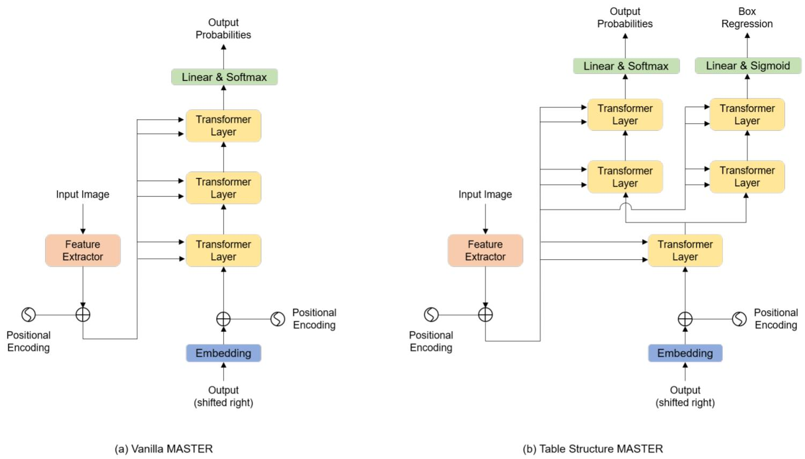

  <h1 align="left">TableMASTER-mmocr</h1>


<!-- TABLE OF CONTENTS -->

<details open="open">
  <summary><h2 style="display: inline-block">Contents</h2></summary>
  <ol>
    <li>
      <a href="#about-the-project">About The Project</a>
      <ul>
        <li><a href="####Method-description">Method Description</a></li>
        <li><a href="#Dependency">Dependency</a></li>
      </ul>
    </li>
    <li>
      <a href="#getting-started">Getting Started</a>
      <ul>
        <li><a href="#prerequisites">Prerequisites</a></li>
        <li><a href="#installation">Installation</a></li>
      </ul>
    </li>
    <li>
      <a href="#usage">Usage</a>
      <ul>
        <li><a href="#data-preprocess">Data preprocess</a></li>
        <li><a href="#train">Train</a></li>
        <li><a href="#inference">Inference</a></li>
        <li><a href="#get-teds-score">Get TEDS score</a></li>
      </ul>
     </li>
    <li><a href="#result">Result</a></li>
    <li><a href="#license">License</a></li>
    <li><a href="#acknowledgements">Acknowledgements</a></li>
  </ol>
</details>


<!-- ABOUT THE PROJECT -->

## About The Project

This project presents our 2nd place solution for **ICDAR 2021 Competition on Scientific Literature Parsing, Task B**. We reimplement our solution by [MMOCR](https://github.com/open-mmlab/mmocr)，which is an open-source toolbox based on PyTorch. You can click [here](https://aieval.draco.res.ibm.com/challenge/40/overview) for more details about this competition. Our original implementation is based on **FastOCR** (one of our internal toolbox similar with MMOCR). 

### Method Description

In our solution, we divide the table content recognition task into four sub-tasks: **table structure recognition**, **text line detection**, **text line recognition**, and **box assignment**. Based on [MASTER](https://arxiv.org/abs/1910.02562), we propose a novel table structure recognition architrcture, which we call **TableMASTER**. The difference between **MASTER** and **TableMASTER** will be shown below. You can click [here](https://arxiv.org/pdf/2105.01848.pdf) for more details about this solution.




### Dependency

* [MMOCR-0.2.0](https://github.com/open-mmlab/mmocr/tree/v0.2.0)
* [MMDetection-2.11.0](https://github.com/open-mmlab/mmdetection/tree/v2.11.0)
* [mmcv-full-1.3.4](https://github.com/open-mmlab/mmcv/tree/v1.3.4)


<!-- GETTING STARTED -->

## Getting Started

### Prerequisites

+ Competition dataset **PubTabNet**, click [here](https://developer.ibm.com/exchanges/data/all/pubtabnet/) for downloading.
+ About **PubTabNet**, check their [github](https://github.com/ibm-aur-nlp/PubTabNet) and [paper](https://arxiv.org/abs/1911.10683).

* About the metric **TEDS**, see [github](https://github.com/ibm-aur-nlp/PubTabNet/tree/master/src) 

### Installation

2. Install mmdetection. click [here](https://github.com/open-mmlab/mmdetection/blob/v2.11.0/docs/get_started.md) for details.
   
   ```sh
   # We embed mmdetection-2.11.0 source code into this project.
   # You can cd and install it (recommend).
   cd ./mmdetection-2.11.0
   pip install -v -e .
   ```
   
3. Install mmocr. click [here](https://github.com/open-mmlab/mmocr/blob/main/docs/install.md) for details.

   ```sh
   # install mmocr
   cd ./MASTER_mmocr
   pip install -v -e .
   ```

4. Install mmcv-full-1.3.4. click [here](https://github.com/open-mmlab/mmcv) for details.

   ```sh
   pip install mmcv-full=={mmcv_version} -f https://download.openmmlab.com/mmcv/dist/{cu_version}/{torch_version}/index.html
   
   # install mmcv-full-1.3.4 with torch version 1.8.0 cuda_version 10.2
   pip install mmcv-full==1.3.4 -f https://download.openmmlab.com/mmcv/dist/cu102/torch1.8.0/index.html
   ```


<!-- USAGE EXAMPLES -->

## Usage

### Data preprocess

Run [data_preprocess.py](./table_recognition/data_preprocess.py) to get valid train data. Remember to change the **'raw_img_root'** and **‘save_root’** property of **PubtabnetParser** to your path.

```shell
python ./table_recognition/data_preprocess.py
```

It will about 8 hours to finish parsing 500777 train files. After finishing the train set parsing, change the property of **'split'** folder in **PubtabnetParser** to **'val'** and get formatted val data.

Directory structure of parsed train data is :

```shell
.
├── StructureLabelAddEmptyBbox_train
│   ├── PMC1064074_007_00.txt
│   ├── PMC1064076_003_00.txt
│   ├── PMC1064076_004_00.txt
│   └── ...
├── recognition_train_img
│   ├── 0
│       ├── PMC1064100_007_00_0.png
│       ├── PMC1064100_007_00_10.png
│       ├── ...
│       └── PMC1064100_007_00_108.png
│   ├── 1
│   ├── ...
│   └── 15
├── recognition_train_txt
│   ├── 0.txt
│   ├── 1.txt
│   ├── ...
│   └── 15.txt
├── structure_alphabet.txt
└── textline_recognition_alphabet.txt
```

### Train

1. Train text line detection model with [PSENet](https://arxiv.org/pdf/1806.02559.pdf). 

   ```shell
   sh ./table_recognition/table_text_line_detection_dist_train.sh
   ```

   We don't offer PSENet train data here, you can create the text line annotations by open source label software. In our experiment,  we only use 2,500 table images to  train our model. It gets a perfect text line detection result on validation set.

2. Train text-line recognition model with [MASTER](https://arxiv.org/abs/1910.02562). 

   ```shell
   sh ./table_recognition/table_text_line_recognition_dist_train.sh
   ```

   We can get about 30,000,000 text line images from 500,777 training images and 550,000 text line images from 9115 validation images.  But we only select 20,000 text line images from 550,000 dataset for evaluatiing after each trainig epoch, to pick up the best text line recognition model.

   Note that our MASTER OCR is directly trained on samples mixed with single-line texts and multiple-line texts.

3. Train table structure recognition model, with **TableMASTER**.

   ```shell
   sh ./table_recognition/table_recognition_dist_train.sh
   ```

### Inference

To get final results, firstly, we need to forward the three up-mentioned models, respectively. Secondly, we merge the results by our matching algorithm, to generate the final HTML code.

1.  Models inference. We do this to speed up the inference.

   ```shell
   python ./table_recognition/run_table_inference.py
   ```

   [run_table_inference.py](./table_recognition/run_table_inference.py) wil call [table_inference.py](./table_recognition/table_inference.py) and use multiple gpu devices to do model inference. Before running this script, you should change the value of **cfg** in [table_inference.py](./table_recognition/table_inference.py) .

   Directory structure of text line detection and text line recognition inference results are:

   ```shell
   # If you use 8 gpu devices to inference, you will get 8 detection results pickle files, one end2end_result pickle files and 8 structure recognition results pickle files. 
   .
   ├── end2end_caches
   │   ├── end2end_results.pkl
   │   ├── detection_results_0.pkl
   │   ├── detection_results_1.pkl
   │   ├── ...
   │   └── detection_results_7.pkl
   ├── structure_master_caches
   │   ├── structure_master_results_0.pkl
   │   ├── structure_master_results_1.pkl
   │   ├── ...
   │   └── structure_master_results_7.pkl
   ```

2.  Merge results. 

   ```shell
   python ./table_recognition/match.py
   ```

   After matching, congratulations, you will get final result pickle file.

### Get TEDS score

1. Installation.

   ```shell
   pip install -r ./table_recognition/PubTabNet-master/src/requirements.txt
   ```

2. Get **gtVal.json**.

   ```shell
   python ./table_recognition/get_val_gt.py
   ```

3. Calcutate TEDS score. Before run this script, modify pred file path and gt file path in [mmocr_teds_acc_mp.py](./table_recognition/PubTabNet-master/src/mmocr_teds_acc_mp.py)

   ```shell
   python ./table_recognition/PubTabNet-master/src/mmocr_teds_acc_mp.py
   ```

   

<!-- Result -->

## Result

**Text line end2end recognition accuracy**

|     Models      |  Accuracy  |
| :-------------: | :--------: |
| PSENet + MASTER | **0.9885** |


**Structure recognition accuracy**

|          Model architecture           |  Accuracy  |
| :-----------------------------------: | :--------: |
|       TableMASTER_maxlength_500       |   0.7808   |
| TableMASTER_ConcatLayer_maxlength_500 | **0.7821** |
| TableMASTER_ConcatLayer_maxlength_600 |   0.7799   |


**TEDS score**

|                         Models                          |    TEDS    |
| :-----------------------------------------------------: | :--------: |
|       PSENet + MASTER + TableMASTER_maxlength_500       |   0.9658   |
| PSENet + MASTER + TableMASTER_ConcatLayer_maxlength_500 |   0.9669   |
|         PSENet + MASTER + ensemble_TableMASTER          | **0.9676** |

In [this paper](https://arxiv.org/pdf/2105.01848.pdf), we reported 0.9684 TEDS score in validation set (9115 samples). The gap between **0.9676** and **0.9684** comes from that we ensemble three text line models in the competition, but here, we only use one model. Of course, hyperparameter tuning will also affect TEDS score.


<!-- LICENSE -->

## License

This project is licensed under the MIT License. See LICENSE for more details.


<!-- Citations -->

## Citations

```latex
@article{ye2021pingan,
  title={PingAn-VCGroup's Solution for ICDAR 2021 Competition on Scientific Literature Parsing Task B: Table Recognition to HTML},
  author={Ye, Jiaquan and Qi, Xianbiao and He, Yelin and Chen, Yihao and Gu, Dengyi and Gao, Peng and Xiao, Rong},
  journal={arXiv preprint arXiv:2105.01848},
  year={2021}
}
@article{He2021PingAnVCGroupsSF,
  title={PingAn-VCGroup's Solution for ICDAR 2021 Competition on Scientific Table Image Recognition to Latex},
  author={Yelin He and Xianbiao Qi and Jiaquan Ye and Peng Gao and Yihao Chen and Bingcong Li and Xin Tang and Rong Xiao},
  journal={ArXiv},
  year={2021},
  volume={abs/2105.01846}
}
@article{Lu2021MASTER,
  title={{MASTER}: Multi-Aspect Non-local Network for Scene Text Recognition},
  author={Ning Lu and Wenwen Yu and Xianbiao Qi and Yihao Chen and Ping Gong and Rong Xiao and Xiang Bai},
  journal={Pattern Recognition},
  year={2021}
}
@article{li2018shape,
  title={Shape robust text detection with progressive scale expansion network},
  author={Li, Xiang and Wang, Wenhai and Hou, Wenbo and Liu, Ruo-Ze and Lu, Tong and Yang, Jian},
  journal={arXiv preprint arXiv:1806.02559},
  year={2018}
}
```


<!-- ACKNOWLEDGEMENTS -->

## Acknowledgements

* [MASTER-pytorch](https://github.com/wenwenyu/MASTER-pytorch)
* [MASTER-TF](https://github.com/jiangxiluning/MASTER-TF)
* [OpenMMLab](https://github.com/open-mmlab)
* [PubTabNet](https://github.com/ibm-aur-nlp/PubTabNet)
* [PSENet](https://github.com/whai362/PSENet)
* [MASTER-mmocr](https://github.com/JiaquanYe/MASTER-mmocr)
* [TableMASTER Report PPT](./imgs/table2html.pdf)
