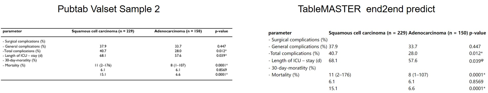

  <h1 align="left">TableMASTER Demo</h1>

This demo script will give a end to end result from a table image input. The checkpoints accuracy we use in this demo, were described in the **pretrained  model** of this repo's README.


### How to run

1. Modify the config and checkpoint path in **ArgumentParser**.

   You can find config in folder **/TableMASTER-mmocr/configs/** :

   **Textline detection (PSENet)** config : psenet_r50_fpnf_600e_pubtabnet.py

   **Textline recognition (MASTER)** config : master_lmdb_ResnetExtra_tableRec_dataset_dynamic_mmfp16.py

   **Table structure (TableMASTER)** config : table_master_ResnetExtract_Ranger_0705.py

   You can also download checkpoints in **Pretrain Model** of <a href="../../README.md">README.md</a>

   

2. Run script. And you will get the table recognition result in a **HTML** file, which saved in the output dir.

```shell
cd /TableMASTER-mmocr
python ./table_recognition/demo/demo.py
```


### Table recognition result





